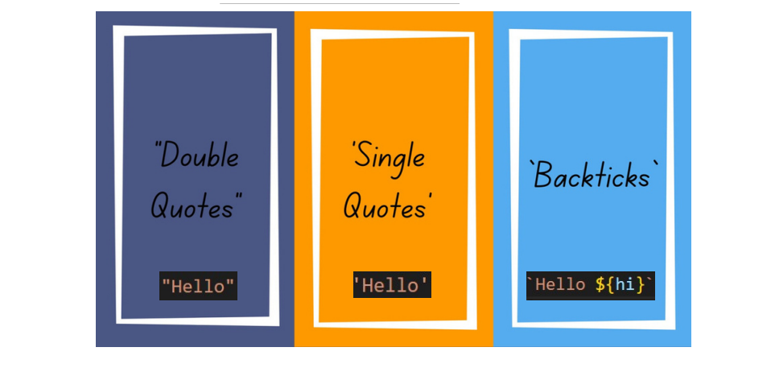

# __***Table of Contents***__
> > ***1.*** **STRIGN**
> <br>
> > ***2.*** **NUMBERS**
## What is a Method in JavaScript?
```
A method is a block of code which only runs when
it is called. You can pass data, known as
parameters, into a method. Methods are used to
perform certain actions, and they are also known
as functions.
```

### Create s t r ing in JavaScr ipt

### JAVASCRIPT STRING METHODS

# STRING in JS
1. #### JavaScript String method charAt()
##### The charAt() method returns the character at a specified index (position) in a string.
##### The index of the first character is 0, the second 1, ...
##### The index of the last character is string length - 1 .


2. #### JavaScript String method at()
##### The at() method takes an integer value and returns a new String.
##### This method allows for positive and negative integers. Negative
##### integers count back from the last string character.
 

3. #### JavaScript String method concat()
##### The concat() method joins two or more strings.
##### The concat() method returns a new string.
##### The concat() method does not change the original string.


4. #### JavaScript String method replace()
##### The replace() method returns a new string with the value(s) replaced.
##### The replace() method searches a string for a value or a regular expression.
##### The replace() method does not change the original string.


5. #### JavaScript String method replaceAll()
##### The replaceAll() method returns a new string with all matches of a pattern replaced by
##### a replacement.

#### ETC ......
# NUMBERS in JS

1. ### The Math.floor() function rounds down a number to the next smallest integer.


2. ### The Math.round() function returns the number rounded to the nearest integer


3. ### Math.ceil() method rounds a decimal number up to the next largest integer and returns it.


4. ### max() method finds the maximum value among the specified values and returns it.


5. ### min() method finds the minimum value among the specified values and returns it.


##### ETC ......
